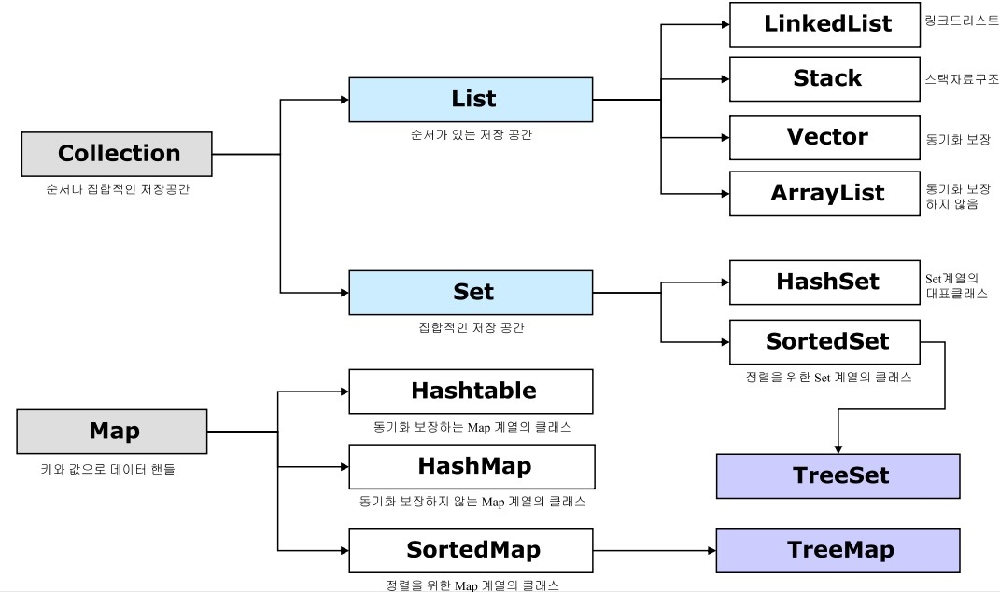

# java-performance
자바 성능 튜닝 이야기를 읽으면서, 내용을 정리.<br>

---

### Story 01 : 디자인 패턴 꼭 써야 한다.

1.디자인 패턴
  - 디자인 패턴 : 코드를 유연하게,  재사용성 및 유지보수가 용이하게 작성할 수 있도록 도와주는 여러가지 코드의 패턴들을 의미.

2.J2EE(JavaEE)
  - J2EE 패턴 : Java 2 Enterprise Edition 을 의미하며, 1999년에 썬 마이크로 시스템즈에서 정의한 기업용 자바 프로그램 개발을 위한 플랫폼(환경)이다.(EJB, JSP/Servlet, JDBC, JNDI, JTA, Java Mail 등)
  - J2EE 라고 불렸으나, 1.4 이후. 그러니까 J2EE 1.4 에서 다음버전으로 올라가면서 JavaEE 5로 개칭이 변경이 되었다.
  - 결론적으로, 자바를 이용하여 기업용 애플리케이션을 만드는데 필요한 스펙 또는 기술들의 집합이다.
  - tomcat / wildfly 등 벤더사들이 위 스펙을 구현할 수 있으며 호환성을 검증는 기구의 검증이 통과하면 JavaEE 호환제품으로 출시.
  - JavaEE는 MVC 구조가 기본으로 깔려있다.

3.MVC 패턴
  - Model / View / Controller 의 약자이며, 모델 / 뷰 / 컨트롤러 역할을 각각 나누어 애플리케이션을 3가지로 나누어 개발하는 패턴이다. 나누어서 개발을 하니, 유지보수와 확장성이 좋으며 디자이너 또는 퍼블리셔와 개발자간 협업시 역할도 명확히 구분이 된다는 장점이 있으나, 조그만한 프로젝트에서 개발 시, 구조 잡고 나누느라 개발시간이 더 소요가 될 수도 있다.
  - MVC 모델1 : 모델1은 요청 흐름을 제어하는 컨트롤러가 특별히 존재하지 않음. 바로 JSP에서 필요한 Java Bean을 호출하여 DB에서 정보 조회 / 갱신 / 수정 업무를 한 후, 바로 클라이언트에 응답을 해주는 방식. (그래서, 모델1은 컨트롤러가 없기 때문에 MVC라고 하기 어렵다)
  - MVC 모델2 : 모델2는 정확히 MVC 패턴을 따른다. 컨트롤러 역할을 하는 서블릿으로 요청을 하여, 모델에서 필요한 요청을 처리 후, 응답을 다시 서블릿으로 전달 후, 클라이언트에 응답을 해준다.

4.J2EE 디자인 패턴(너무 많아서 몇개만 한다.)
  - Front Controller : 클라이언트 요청 시, 제일 앞단에 다양한 요청을 제어하는 컨트롤러를 두어 단일 진입을 하게 한다고 해서, Front Controller 패턴이라고 불리운다. 컨트롤러로 향하는 모든 요청의 entry point 다.(spring 에서 Dispatcher Servlet이 이런 역할을 하지요. Dispatcher Servlet에서 요청을 가로채면 Handler Mapping을 통해(URL), 어떤 컨트롤러에게 요청을 위임하면 좋을지 찾음.)

  - Transfer Object : Value Object(VO) 라고도 불리는 데이터를 전송하기 위한 객체에 대한 패턴이다.
  ```java
  import java.io.Serializable;

  public class MemberTO implements Serializable {
      private String memberName;
      private int memberAge;

      public String getMemberName() {
          return memberName;
      }

      public void setMemberName(String memberName) {
          this.memberName = memberName;
      }

      public int getMemberAge() {
          return memberAge;
      }

      public void setMemberAge(int memberAge) {
          this.memberAge = memberAge;
      }

      @Override
      public String toString() {
          return "MemberTO{" +
                  "memberName='" + memberName + '\'' +
                  ", memberAge=" + memberAge +
                  '}';
      }
  }

  ```
  어디서, 많이 봤을법한 코드이다. 객체에 여러 타입의 값을 전달하는 일을 수행.
  getter / setter를 만들지, 필드에 접근제어자를 private으로 할지에 대한 정답은 없지만. 성능상으로 볼 때, getter / setter를 만들지 않는 것이 더 빠르다. Serializable 를 왜 구혀했을까? 객체를 직렬화를 하면, 서버 사이의 데이터 전송이 가능해 지기 때문이다. 이 패턴은 하나의 객체에 여러 타입의 값을 담아오기 위해 사용하는 패턴이라는 것을 명심하자.(값을 캡슐화 하는거임. 그리고 대부분, JavaBeans 규칙을 따라서 Java Bean이라고도 한다.)

  - Data Access Object : DAO패턴이라고 불리우며, 해당 패턴을 통해 저수준의 데이터 엑세스 로직과 비즈니스 로직을 분리한다. 일반적으로, DAO 인터페이스를 두고 해당 인터페이스를 구현하여, 구현클래스를 통해 DB와의 엑세스를 주고 받습니다.

---

### Story 02 : 내가 만든 프로그램의 속도를 알고 싶다.

1.프로파일링 툴?
- 프로파일링툴이란, 분석 도구라고 생각하면 된다.(profiler : 심리 분석관 / profile : 개요, 윤곽)

2.APM?
- APM 툴을 의미한다.(Application Performance Monitoring) 애플리케이션 성능 분석 도구라고 생각하면 된다.

3.프로파일링 툴 vs APM 뭐가 다른가요?
- 프로파일링툴은 개발환경
- APM은 운영환경
- 프로파일링툴은 개발환경에서, 세부응답속도 및 객체 / 클래스 등의 소스레벨 분석을 위해 사용한다.
- APM은 운영환경에서 실시간 모니터링 및 문제점 진단과 서버에 사용자 수 / 리소스에 대한 모니터링을 위해 사용한다.

4.이러한 좋은 툴이 있는건 알겠는데? 간단한 방법 없을까?
- Java System 클래스를 이용하면 된다.
- System.currentTimeMillis() : 현재의 시간을 ms로 리턴(1/1000 초)
- 위 메서드를 활용하여, 시작시간과 종료시간을 구하고, 응답시간 = 종료시간 - 시작시간을 하면 된다.
- JDK 5 버전에서 nanoTime() 메서드가 추가되어 이를 이용해도된다.(ns로 리턴)

---

### Story 03 : 왜 자꾸 String을 쓰지 말라는거야.

```Java
        //자바 메모리 사용량 확인을 위한 예제 코드
        //totalMemory : 현재 Allocate 된 메모리 사용량을 리턴(할당된, 전체 메모리)
        //freeMemory : 현재 Allocate 된 메모리 중, 사용 가능한 메모리 양을 리턴(전체에서 사용되어진걸 제외한 메모리 용량)

        System.gc(); //JVM 메모리 초기화.(절대 명시적으로 사용하면 안된다.)

        long startTime = System.currentTimeMillis();

        String testString = "";
        for(int i = 1; i<=20000; i++){
            testString += "이 문자열을 200번 계속 붙이자!";
        }

        long endTime = System.currentTimeMillis();

        long afterMemory = Runtime.getRuntime().totalMemory() - Runtime.getRuntime().freeMemory();
        System.out.println("사용 메모리(MB) : " + afterMemory / (1024.0*1024.0));
        System.out.println("응답시간 : " + (endTime - startTime) / 1000.0);
```
결과 <br>
사용 메모리(MB) : 247.31979370117188 <br>
응답시간 : 7.405 <br>

계속 돌려보면 딱 저 결과로 나오지는 않지만.. 뭔가 상당히 느리고 낭비가 된다는 생각이 든다.

```Java
System.gc(); //JVM 메모리 초기화.(절대 명시적으로 사용하면 안된다.)

        long startTime = System.currentTimeMillis();

        StringBuilder testString = new StringBuilder();
        for(int i = 1; i<=20000; i++){
            testString.append("이 문자열을 200번 계속 붙이자!");
        }

        long endTime = System.currentTimeMillis();

        long afterMemory = Runtime.getRuntime().totalMemory() - Runtime.getRuntime().freeMemory();
        System.out.println("사용 메모리(MB) : " + afterMemory / (1024.0*1024.0));
        System.out.println("응답시간 : " + (endTime - startTime) / 1000.0);

```
위 코드를 StringBulider로 변경해서 실행을 해봤다. 놀랍다. <br>
결과 <br>
사용 메모리(MB) : 2.9069900512695312 <br>
응답시간 : 0.004 <br>

1.StringBuffer / StringBuilder 클래스
- JDK 5 기준으로, StringBuilder 클래스 추가.
- 버퍼와 빌더는 무엇이 다를까? StringBuffer는 ThreadSafe 설계되어 있어서, 여러 스레드가 하나의 StringBuffer 객체를 처리해도 전혀 문제가 되지 않으면, StringBuilder는 단일스레드에서의 안전성만을 보장한다.
- append() / insert() 의 차이는? append()는 기존 값의 끝 자리에 넘어온 값을 덧붙이는 작업을 해주며, insert()는 지정된 위치 이후에 넘어온 값을 덧붙이는 작업을 수행해준다. insert()는 지정한 위치까지 값이 할당되어 있지않으면 exception이 발생하니 주의하자.

```Java
StringBuilder testString = new StringBuilder();
        testString.append("전설의죽음" + 123123);
```
만약 append()를 이렇게 쓰지 않길 바란다. 효과가 없다..

2.왜? String은 느리고, StringBuffer / StringBuilder 는 빠른가요?
```Java
String addString = "abcd";
        String a = "";

        for(int i = 1; i<=3; i++){
            a += addString;
            System.out.println(a.hashCode());
        }

        System.out.println("-------------------");

        StringBuffer buffer = new StringBuffer();
        for(int i = 1; i<=3 ; i++){
            buffer.append("abcd");
            System.out.println(buffer.hashCode());
        }

```
결과 <br>
2987074 <br>
1259550596 <br>
-1743689274 <br>
------------------- <br>
1452126962 <br>
1452126962 <br>
1452126962 <br>

hashCode()를 이용하면, 주소값을 출력했다. String 클래스같은 경우 더해지면 새로운 주소와 더해진 결과값을 갖는 a 객체가 생성된다. 이런 작업이 반복 수행되면서, 메모리를 많이 사용하게 되고 응답속도에도 영향을 미친다.(이 과정에서 쓰레기 객체는 GC가 수행이 되는데. 이녀석은 호출하면 할 수록 CPU 사용도 많이하고 느림..ㅠㅠ)

반면에, StringBuffer / StringBuilder 는 객체를 새로 생성하지 않고, 기존 객체에서 크기를 증가시키면서 값을 증가시킨다.
그러면, String 클래스는 왜 새로객체 만듬? 이녀석 자체가 불변클래스라서 그렇다. 그래서 새로운 녀석을 만들어 버리는거다.(원래 녀석은 절대 변하지 않음.)

- String / StringBuffer / StringBuilder 사용 시, 각각의 특징을 파악하여 사용해야함.(String은 짧은 문자열 처리 또는 변하질 않을 문자열에 사용. StringBuffer는 스레드에 안전한 프로그램이 필요할 때 또는 안전한지 모를 경우 사용. StringBuilder는 스레드 안전성 여부와 관계 없는 프로그램을 개발 할 때 사용.)

---

### Story 04 : 어디에 담아야 하는지..

- Java에서 데이터를 담아둘 때, collection framework(List, Map 등) 와 배열을 많이 이용한다.
- 왜? 의미있는 데이터는 함께 묶어 관리하는게 이득이기 때문. 데이터가 많아지면 하나하나 변수선언하면서 할 것도 아니지 않는가.

1.배열(array)
- 배열은 데이터의 집합이다. 같은 데이터를 한번에 또는 하나의 이름으로 관리하기 위한 자료구조이다.

```Java
//배열 선언
        int a[] = new int[3];
        int[] b = new int[5];

        int c[] = {1,2,3,4,5};
        int[] d;
        d = new int[3];
        d[0] = 11;
```

- 배열은 정의와 동시에, offset을 변경할 수 없다.
- 배열의 index는 값에 대한, 유일무이한 식별자이다.
- 배열도 객체이기 때문에, Heap영역에 할당이 되며, 메모리는 연속적으로 잡힘.

2.collection framework
- 컬렉션 프레임워크는 자바에서 데이터의 집합을 관리하기 쉽게 제공해주는 표준 클래스들이다.


- ArrayList / Vector / LinkedList / Stack은 List 인터페이스를 구현한 클래스다. 마찬가지로, HashSet / TreeMap 은 Set 인터페이스를 구현한거고. Map 인터페이스를 구현한 클래스들도 존재한다.

3.그래서 어디에 담아야하니..??
- Set 인터페이스 : HashSet, TreeSet, LinkedHashSet (중복을 허용하지 않는다)
- HashSet : 해쉬테이블에 순서에 상관없이 데이터를 저장.
- TreeSet : red-black 이라는 트레이 데이터를 저장, 정렬방법 지정이 가능하며 데이터를 담으면서 정렬을 하기 때문에 느리다.
- LinkedHashSet : 해쉬테이블에 데이터를 담으며, 담은 순서(추가된 순서)에 따라 순서가 정해짐.
- 저장성능 : HashSet > LinkedHashSet > TreeSet
- HashSet에 데이터를 담을 시, 크기를 미리 지정해주면 큰 차이는 나지 않지만 성능 향상
- 읽기성능 : LinkedHashSet > HashSet > TreeSet (for문으로 반복)
- TreeSet은 다 느린데, 쓰지말아야 하는건가? 느린 이유는 정렬 프로세스가 있어서 그렇다(NavigableSet<E>). 만약, 데이터를 순서에 따라 탐색하는 작업이 필요하면 TreeSet을 사용하면 좋다.

---
- List 인터페이스 : ArrayList, Vector, LinkedList (중복을 허용 / Index를 이용하여, 데이터를 검색 및 추가 삭제 가능.)
- ArrayList : Vector와 같으나, 동기화 처리가 되어있지 않다. 순차접근 / 임의접근 가능
- Vector : 동기화 처리가 되어있다.(ArrayList의 구버전) 동기화가 되어있다는거는 여러스레드에서 접근할 수 없다는 의미이다.(스레드가 동기화 된 메소드를 실행하면, 그 스레드가 종료될 때까지 모든 스레드는 중지)
- LinkedList : ArrayList와 동일하지만, 양방향 포인터 구조로 데이터를 삽입. 순차접근만 가능.
- 저장성능(add()) : ArrayList > Vector > LinkedList (크게 차이는 안남)
- 읽기성능(get()) : ArrayList > Vector > LinkedList (ArrayList가 압도적으로 빠름)
- LinkedList 읽기성능이 느린 이유는 public interface Deque<E> extends Queue<E> 이러한 친구를 상속받기 때문. 그래서, peek()를 이용하면 제일 빠르다. -> 그래서, LinkedList를 사용하는 경우, peek() / poll() 을 사용해야한다.
- 삭제 또는 추가성능 : ArrayList > LinkedList > Vector / 삭제는 ArrayList가 압도적으로 빠름.

- 추가 삭제 시, 성능차이가 발생하는 이유는 그림을 보면 알 수 있다.
중간에 삽입 / 삭제가 일어나면 그만큼 데이터를 앞으로 이동 또는 뒤로 이동하는 연산이 발생하기 때문이다. 반면에, 제일 마지막값을 삭제하거나 추가하면 위와같은 연산이 발생하지 않기때문에 빠르다.


- LinkedList는 추가 / 삭제 시 ArrayList처럼 사이즈를 늘리고 줄여주는(인덱스를 채워주는) 연산이 발생하지 않기 때문에.(왜? Node의 주소만 서로 연결시켜주면 되기 때문.) 그래서, 추가 / 삭제가 빈번하게 발생할 경우, LinkedList는 좋은 선택이 될 수 있다.

---

- Map 인터페이스(Key By Value) : HashTable, HashMap, TreeMap, LinkedHashMap
- HashTable : 해시테이블을 사용한 클래스, 동기화 되어있음, Null 허용X
- HashMap : 해시테이블을 사용한 클래스, 동기화X, Null 허용O
- TreeMap : red-black 트리에 데이터를 담는데, TreeSet과 다른 점은 Key에 의해서 순서가 정해진다.
- LinkedHashMap : HashMap가 동일하며, 이중연결리스트 방식을 사용하여 데이터를 담는다.
- 저장성능 : 성능자체는 다 비슷.
- 읽기성능 : HashMap > LinkedHashMap > HashTable > TreeMap

---
Collection 관련 클래스를 보면, 동기화 처리가 되어있는게 있고 안되어있는 애들이 있다. 그럼 동기화 되어있는, Vector / HashTable 을 사용해야만 하는가? 이녀석들이 있는건 JDK 1.0 호환을 위한거라고 생각하자.(거의 잘 사용이 되지 않는다.) 그러면 뭘 써야하지? Collections 클래스를 보면, 지원해주는 메서드들이 있다.


synchronized 로 시작되는 메서드들이 동기화가 처리된 클래스이다.

- 정리하면, 일반적인 웹을 개발할 때는 Collection 성능 차이를 비교하는것은 큰 의미가 없다.(하지만, 데이터가 많아지면 그때 고민을 해봐야함) + 항상 상황과 목적에 맞는 클래스를 선택해서 사용하면 된다.

---

### Story 06 : static 제대로 한번 써 보자.
- static : 정적 변수와 정적 메소드를 선언하기 위한 키워드 / 생명주기는 프로그램 종료할때까지임.
- static의 특징은 다른 JVM에서는 static이라고 선언해도 다른 주소나 다른 값을 참조하지만, 같은 JVM이나 같은 WAS 인스턴스에서는 같은 주소와 같은 값을 참조한다는 점입니다. 그리고 GC의 대상도 되지 않습니다.
1.자주 사용하고, 절대 변하지 않는 변수는 final static 으로 선언해서 사용하자.
2.설정 파일 정보도 static으로 관리하자.
3.코드성 데이터는 DB에서 한번만 읽자.(자주 변경되거나, 데이터 양이 너무 많으면 X)

- static을 웹에서 잘못 쓰면, 오류 또는 잘못된 값이 나온다. 왜? 웹은 여러사용자가 이용하는데, static 변수를 사용을 하는 무언가를 호출하면. 누군가 사용하면서 값이 true인게, 다른사람이 호출하면 false가 되면서 완전 다른 결과를 받게 된다.

- static으로 선언한 부분은 GC가 발생하지 않는다. 만약, Collection 관련 클래스를 static으로 구현하면..? 그리고 이 클래스들(ArrayList / HashMap 등)이 데이터가 쌓인다면..? GC가 되지않으니.. 언젠간 OutOfMemory를 발생시킨다. (이렇게 점점 메모리가 줄어드는 현상을 메모리 Leak 라고 한다.)

- 정리하면, static의 개념을 잘 이해하고 활용하면 성능을 향상 시킬 수 있다. 하지만, 잘못 사용하면 시스템 다운 또는 예기치 못한 결과가 나올 수도 있다. 왜? static은 반드시 메모리에 올라가고, GC 대상이 되지 않기 때문이다. 메모리에 올라간 시점에 값은 초기화 되어있고, 해당 static 변수는 JVM내에서 공유가 되어지기 때문.(해당클래스로 누구든 접근을 해서 같은곳을 참조할테니.)

---

### Story 10 : 로그는 반드시 필요한 내용만 찍자
- 로그는 시스템 또는 서버의 정보를 시간에 따라, 남기를 기록을 의미. 어떠한 정보를 기록하는지는 조금씩 다를 수 있으나 대부분 기본적인 실행내역 및 에러내역을 모두 로그로 남겨두고 있다.

1.System.out.println()
- 개발자들이 로그를 찍기 위해, 대부분 쉽게 사용하는 메서드다. 하지만, 성능에 매우 많은 영향을 준다.
- println() 자체는 느리지 않다. 다만.. 입출력에 대해서 알아야 하는데, Java IO는 stream 이라는 통로를 통해 데이터를 주고받는데 System.out.println()은 PrintStream을 통해서 구현이 되어있다.(구현보다는 이를 이용해서 작동한다가 맞는 표현인거 같다 아니면 PrintStream의 일종?)
- stream을 통해 출력 / 저장 / 읽기 등의 작업을 수행하면 이 작업들이 완전히 끝날때까지 대기를 한다. 그렇게 되면, 애플리케이션 대기 시간이 발생한다. 대기시간은 시스템 속도에 의존적이며, 디스크에 직접 로그를 남긴다면 디스크의 RPM이 높을수록 속도가 빨라질 것이다.
- 결론적으로는 운영중에는 이러한 디버그용 로그를 고스란히 처리하고 있으니 매우 느려진다.(서버의 리소스와 디스크가 낭비)

2.System.out.format()
- JDK 1.5에서 새로 추가된 녀석. C에서 프린트 하던 형식처럼 처리할 수 있다는 장점이 있음.
- System.our.println() 보다 느리다. format 문자열을 항상 파싱하기 때문에, 문자열을 그냥 더하는 것보다 성능이 좋을 수 없다.
- 디버그용으로는 추천 이유는 편리하고, 가독성이 좋다. 하지만 운영중에는 이러한 디버그용 로그는 역시 느려질수 밖에 없으니 삭제를 명심하길 바람.

3.로그를 간결하게 처리하기 위해서는..?
- Logger를 사용하여 로그를 처리하는 것.
- 만약, Logger를 사용하기 어려운 경우는 자체 로거 클래스를 만드는 방법과 시스템 로그를 컴파일 할 때, 삭제하는 방법이 있음.(자체로거 보다는 좋은 오픈소스를 추천)
- 컴파일 할 때, 시스템 로그 삭제 방법은 boolean 타입의 변수(final)를 통해 on/off 하는 방식으로 작동하게 하면 된다.(또는 properties를 읽어서 사용해도 좋을듯?) 보통 주석처리를 하는데(나도 그랬다;;) 일괄변경이 가능하게 해야하는데.. 몇천줄 몇만줄 되는거 하나하나 주석처리 하면서 언제 수정을 할건가 그리고 일괄주석처리를 잘못하면 컴파일 오류가 발생할 확률도 높다.
- 로거를 사용하면 로거 객체를 생성해야 하는데, 운영 로그는 괜찮지만 디버그 레벨에 로그 또한 객체가 생성되어져 코드로 남아 있을 확률이 높다.(아무일도 안하면 GC가 수행이 되고.. GC 수행시간이 발생하면 메모리와 시간이 소요된다) 결론적으로 디버그 로그는 삭제해서 불필요한 리소스 낭비가 없도록 해야하며, 이런 문제점을 개선해서 쉽게 사용하느게 slf4j / logBack 라는 로거가 있다.(문자열 더하기 연산 처리 등..)

- 예외 처리시에는 필요한 정보만 보는게 좋다. printStackTrace() 로 보통 찍고 넘어가는데, 콘솔에 이 메시지가 찍히면.. 알아보기도 힘들고 자바의 예외 스택 정보는 로그를 최대 100개 까지 프린트하기 때문에 서버의 성능에도 많은 부하를 준다. 그래서, 예외 처리 시 원하는 스택 정보를 가공하여 메시지를 처리하는 것도 좋은 방법이다.

---

### JSP와 Servlet의 기본개념 및 생명주기
1.JSP ?
- Java Server Page(JSP) 를 의미하며, 클라이언트 요청으로 부터 동적 컨텐츠를 생성하여 응답해주는 역할을 하기 위한 기술.
- JSP는 Servlet으로 변환이 되기 때문에, JSP 버전과 Servlet 버전은 깊은 연관성을 가진다.
- JSP 2.2 Servlet 3.0 / JSP 2.3 Servlet 3.1

2.Servlet ?
- 클라이언트의 요청을 처리하고, 응답해주는 Servlet API 규칙을 지킨 기술. 흔히, 자바로 구현된 CGI라고 말합니다.(우리가 보통 서블릿 클래스를 작성하면, HttpServlet 추상클래스를 상속받는다.)


3.생명주기(LifeCycle)
- JSP(Java Server Page)


1. JSP 페이지 호출
2. JSP 페이지 컴파일(Servlet 으로 변신!)
3. 클래스 로딩
4. 서블릿 클래스의 인스턴스 생성
5. jspInit() 호출
6. _jspService() 호출
7. jspDestroy() 호출(JSP의 서블릿을 제거할 때, 또는 WAS 종료시.) <br>
JSP도 결국은 Servlet으로 변환이 된다. 하지만, 약간 차이점이 있다면 Servlet API를 확장한 HttpJspPage 인터페이스를 구현한 서블릿이다. <br>
이미 인스턴스가 존재하거나, 변경되지 않으면 2~4번 작업이 생략 된다.


- Servlet


1. 서블릿 클래스 로딩
2. 서블릿 클래스의 인스턴스 생성
3. init() 호출 : 최초 1번 호출
4. service() 호출
5. destroy() 호출 <br>
서블릿은 JVM에 여러객체를 생성하지 않는다, 쓰레드풀에서 살아있는 서블릿을 꺼내오거나, 새로운 쓰레드를 만들어서 서블릿의 service()를 호출하여 공유.


Servlet 인터페이스를 상속받은 JspPage 인터페이스가 HttpJspPage를 상속하는 구조이다.

```Java
package javax.servlet;
import java.io.IOException;
public interface Servlet {
    void init(ServletConfig var1) throws ServletException;

    ServletConfig getServletConfig();

    void service(ServletRequest var1, ServletResponse var2) throws ServletException, IOException;

    String getServletInfo();

    void destroy();
}
----------------------------------------
package javax.servlet.jsp;
import javax.servlet.Servlet;
public interface JspPage extends Servlet {
    void jspInit();
    void jspDestroy();
}
----------------------------------------
package javax.servlet.jsp;
import java.io.IOException;
import javax.servlet.ServletException;
import javax.servlet.http.HttpServletRequest;
import javax.servlet.http.HttpServletResponse;
public interface HttpJspPage extends JspPage {
    void _jspService(HttpServletRequest var1, HttpServletResponse var2) throws ServletException, IOException;
}
```

- 정리하며, JSP는 Servlet으로 변환이 되며, 생명주기는 Servlet과 유사하다.(왜? Servlet 인터페이스의 init / service / destory를 확장한 메소드를 가지고 있음.) 웹 컨테이너가 서블릿을 인스턴스화 하고 init() -> jspInit() 호출, service() 에서 _jspService() 를 호출한다, 웹 애플리케이션이 종료되면.. destory() -> jspDestroy()를 호출한다

---

### Story 17 : 도대체 GC는 언제 발생할까?

1.GC 란?
- Garbage Collector (: GC)
- 자바에서 메모리를 관리.
- 자바에서는 GC 알고리즘을 통하여 메모리를 자동으로 관리. 개발자가 메모리를 처리하기 위해 로직을 만들 필요가 없고 절대로 만들어서도 안된다.

2.GC의 역할
- 메모리 할당
- 사용 중인 메모리 인식
- 사용하지 않는 메모리 인식

3.JVM 메모리 구조


위 사진은 JVM이 플랫폼종류에 의존적이지 않고, 독립적으로 실행이 되는 구조를 설명.


Java8 에서 Permanent 영역이 사라지고, METASPACE라는 네이티브 메모리영역에 메타데이터들이 이동.

- PC 레지스터
- 스택 영역
- 힙 영역
- 메서드 영역
- 런타임 상수 풀
- 네이티브 메서드 스택

뭔가 크게 6가지로 나뉘어 지는데, 이영역 중에서, GC가 발생하는 부분은 Heap 영역이다.
Heap 영역에는 new 연산자로 생성한 객체 또는 인스턴스, 배열이 메모리에 쌓인다. 그리고, 힙 영역과 메서드 영역을 JVM 실행 시 생성된다.


- Heap 영역은 크게 Young / Old / Perm 3가지 영역으로 나뉜다.(Java8에서는 Perm 영역 빠이)
- Young : Eden / Survivor 0 / Survivor 1
- Old : 메모리 영역

- 일단, 메모리에 객체가 생성되면 Eden 영역에 할당한다.
- Eden 영역이 꽉 차면, 옮겨지거나, 삭제가 되는데. 옮겨지는 영역이 Survivor 영역이다.
- Survivor 영역 중 한 곳은 무조건 비어져 있다. 비어져 있는 곳은 Eden 영역에 있던 GC후에 살아남은 객체들이 이동한다.
- Eden 영역이 꽉 차서, 옮겨진 객체들이 할당된 Survivor 영역이 꽉 차면, GC가 되면서, Eden에 있는 객체와 꽉 찬 Survivor에 있는 객체가 비어져 있는 Survivor로 이동한다.


이러한 작업을 반복하면서, Survivor0 / Survivor1 을 왔다갔다 하던 객체들은 Old 영역으로 이동된다. 그리고 Young 영역에서 바로 Old 영역으로 넘어가는 객체들이 존재하는데.. 크기가 큰 객체들이다.(Survivor 영역의 크기가 10MB 인데, 객체가 20MB 짜리면. 담을 수가 없으니.. 바로 Old로 넘긴다.)

- Minor GC :  Young 영역에서 발생하는 GC
- Major GC : Old 영역에서 발생하는 GC
- GC가 발생할 때, 객체가 각 영역에서 다른 영역으로 이동할 때, 병목현상이 발생하면서 성능에 영향을 주게 됩니다.(그래서, JVM에서는 쓰레드 로컬 할당 버퍼를 사용)

- 5가지 GC 방식을 제공(JDK 7 이상) WAS 또는 자바 실행 시, 옵션을 지정하여 선택 가능 <br>
1.Serial Collector (이하 시리얼 콜렉터) <br>
2.Parallel Collector (이하 병렬 콜렉터) <br>
3.Parallel Compacting Collector (이하 병렬 컴팩팅 콜렉터) <br>
4.Concurrent Mark-Sweep (CMS) Collector (이하 CMS 콜렉터) <br>
5.Garbage First Collector (이하 G1 콜렉터) <br>

위의 내용들은 너무 많으니 생략. 어떤 GC를 사용하던 애플리케이션 성능에 영향을 미친다는 점을 기억하자. 만약, System.gc() / Runtime.getRuntime().gc() 를  포함시키면 그만큼 응답속도에 영향을 미치니.. 그러지말자

- Java8 에서는 PremGen 영역이 사라져서, Heap 영역에서 사용할 수 있는 메모리가 늘었다. PremGen에서 다루던 데이터는 METASPACE 즉. native memory 영역으로 옮겨갔다.(일부는 heap으로..)

---

### Java 컴파일 및 실행과정.

- JDK : Java Development Kit
- JDK = JRE + (JavaDoc, debugging tools, javac)
- JRE = java + JVM + 라이브러리

- Java 소스 -> 컴파일(javac.exe) -> 바이트 코드(.class) -> JVM(-> 클래스 로딩 -> 배치 -> 실행)

- JVM은 실행 시, 가장 먼저 스태틱 영역에 java.lang 패키지를 반드시 포함시킨다. 다음은, 개발자가 작성한 import 패키지를 스태틱 영역에 포함 시켜준다. 마지막으로는 자바코드내에 있는 모든 클래스를 스태틱 영역에 포함시킨다.
